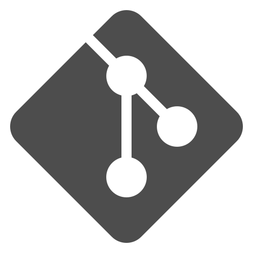

# 👋 Hello there, I'm Manju Madhav

I'm a **BE student** specializing in **Computer Science and Design**, with a passion for **web development**. I enjoy creating user-friendly interfaces and working on projects that seamlessly blend **creativity** with **functionality**. Currently, I’m focused on developing **dynamic websites** and **applications**.

Feel free to check out my projects or reach out if you'd like to **collaborate**!

---

## 🔗 **Connect with Me**

- **📧 If you'd like to connect, feel free to reach out via [email](mailto:manjumadhav.va@gmail.com).**  
- **🌐 To know more about my projects, visit my [portfolio](https://bit.ly/manjumadhav-xo).** 
- **📝 Check out my [resume](https://github.com/violetto-rose/violetto-rose/blob/main/img/Resume%20(teal).pdf) for more details on my experience.**

## 🌟 Social Media

&nbsp;&nbsp;&nbsp;&nbsp; 

&nbsp;&nbsp;&nbsp;&nbsp; 

&nbsp;&nbsp;&nbsp;&nbsp; 

&nbsp;&nbsp;&nbsp;&nbsp; 

&nbsp;&nbsp;&nbsp;&nbsp; 

&nbsp;&nbsp;&nbsp;&nbsp; 

---

## 🛠️ **Tools & Technologies**

| **Category**               | **Technologies**                                                                                                                                         |
|----------------------------|---------------------------------------------------------------------------------------------------------------------------------------------------------|
| **Programming Languages**   |                                                  |
| **Scripting**               |                                         |
| **Frameworks**              |                                                                                                                |
| **Database**                |                                                                                                                    |
| **Others**                  |                                                                                  |

---

## 📊 **GitHub Stats**

  
  

---

## 🚀 **Recent Projects**

| **Project**                | **Description**                                                                                              | **Role**               |
|----------------------------|--------------------------------------------------------------------------------------------------------------|------------------------|
| 🎨 **BhaavChitra**          | A **sentiment analysis tool** that integrates BERT and VADER models to analyze the sentiment of text.         | *(Full-Stack Developer)* |
| 🍽️ **Swaad Sanchalan**      | A **comprehensive restaurant management system** for handling menu management, reservations, billing, and sales reporting. | *(Full-Stack Developer)* |
| 📖 **OBE Tracker**          | A system to facilitate **Outcome-Based Education** by tracking course and program outcomes.                 | *(Full-Stack Developer)* |

---

Thanks for stopping by! 😊
